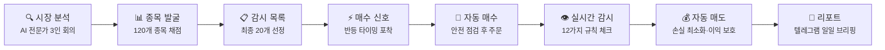
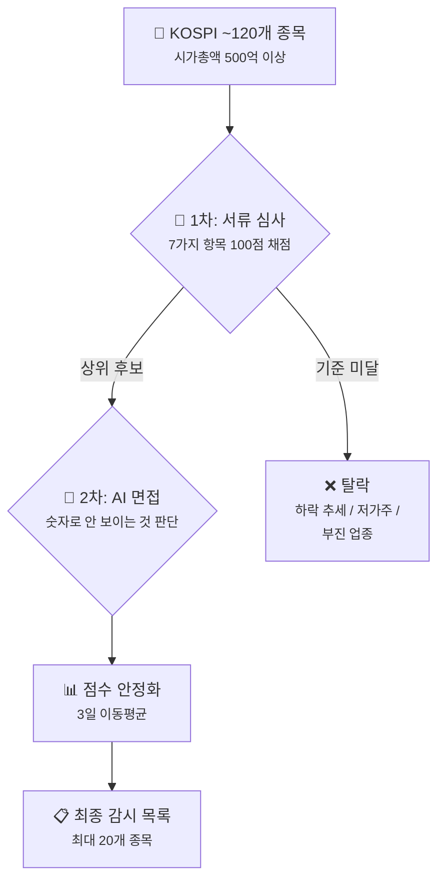
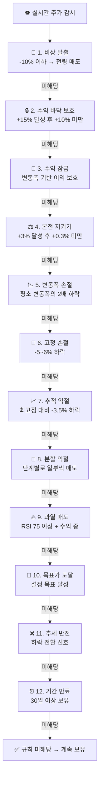
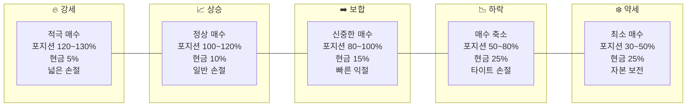

# 🤖 Prime Jennie — AI가 대신 투자해주는 똑똑한 비서

**"AI가 발굴하고, 통계가 검증하고, 사람이 결정한다."**

*개인 투자자를 위한 AI 기반 한국 주식 자동 매매 시스템*

> ⚠️ **투자 유의사항**: Prime Jennie는 투자 보조 도구입니다. 과거 성과가 미래 수익을 보장하지 않으며, 시스템 오류·시장 급변 등으로 손실이 발생할 수 있습니다. 최종 투자 판단과 책임은 사용자에게 있습니다.

---

## 📌 한 줄 소개

> **Prime Jennie**는 AI가 매일 종목을 분석하고, 적절한 타이밍에 자동으로 매수·매도하며, 철저한 리스크 관리까지 해주는 주식 자동 매매 시스템입니다.

### 왜 만들었을까?

주식 투자를 해보신 분이라면 이런 경험이 있으실 겁니다:

- 📱 뉴스에 불안해서 밑에서 팔았는데, 다음 날 급등
- 😰 "조금만 더 기다리면 오르겠지..." 하다가 -30%
- 🤯 지인 추천으로 샀는데, 이미 고점이었던 주식
- 😴 장 마감 후 "오늘도 차트 못 봤네..."

**Prime Jennie**는 이런 **감정적 매매의 한계**를 해결하기 위해 만들어졌습니다.

- 🧠 **AI 3명이 매일 시장을 분석**하고
- 📊 **120개 종목을 숫자로 채점**하고
- ⚡ **최적의 타이밍에 자동 매수·매도**하고
- 🛡️ **12가지 안전장치로 손실을 최소화**합니다

사람이 할 일은? **시스템이 보내주는 리포트를 확인하는 것**뿐입니다.

---

## 🗺️ 전체 흐름 한눈에 보기

각 단계가 하는 일을 쉽게 풀어보겠습니다:

| 단계 | 무엇을 하나? |
|------|-------------|
| 🔍 **시장 분석** | 3명의 AI 전문가가 "오늘 시장에서 적극적으로 투자해도 되는 날인지" 판단합니다 |
| 📊 **종목 발굴** | KOSPI 약 120개 종목을 재무·기술·뉴스·수급 등 7가지 항목으로 채점하고, AI가 한번 더 검토합니다 |
| 📋 **감시 목록** | 최종 선발된 20개 종목을 실시간으로 지켜봅니다 |
| ⚡ **매수 신호** | 주가가 단기 하락 후 반등 신호를 보이면 매수 타이밍을 포착합니다 |
| 🛒 **자동 매수** | 비슷한 종목을 이미 갖고 있진 않은지, 너무 많이 사는 건 아닌지 안전 점검 후 주문합니다 |
| 👁️ **실시간 감시** | 매수 후 실시간으로 주가를 감시하며 12가지 매도 규칙을 체크합니다 |
| 💰 **자동 매도** | 손실을 최소화하고 이익을 지키는 방향으로 자동 매도합니다 |
| 📱 **리포트** | 매일 오후 5시, 텔레그램으로 오늘의 거래 결과와 내일 전략을 보내줍니다 |

---

## 🌤️ 시장 분위기 판단 — "오늘 공격해도 될까?"

매일 아침, **3명의 AI 전문가**가 모여 시장 상황을 분석합니다.

### AI 전문가 3인

| 역할 | 하는 일 |
|------|--------|
| 🎯 **전략가** | 글로벌 경제 지표(환율, 금리, 물가 등), KOSPI 지수, 외국인·기관 자금 흐름을 분석하고 시장 방향을 제시합니다 |
| 🛡️ **리스크 분석가** | 전략가의 분석을 검증하고, 정치·지정학적 리스크와 숨겨진 위험 요소를 찾습니다 |
| ⚖️ **수석 심판** | 두 전문가의 의견을 종합하여 최종 시장 판정을 내립니다 |

### 시장 5단계 분류

분석 결과에 따라 시장을 5단계로 나누고, 각 단계에 맞게 매매 전략을 자동 조절합니다:

| 단계 | 의미 | 시스템의 행동 |
|------|------|-------------|
| 🔥 **강세** | 시장이 매우 좋다 | 적극 매수, 최대 10종목 보유, 현금 5%만 유지 |
| 📈 **상승** | 시장이 좋은 편 | 정상 매수, 현금 10% 이상 유지 |
| ➡️ **보합** | 방향을 잡지 못함 | 신중한 매수, 현금 15% 이상 유지, 익절 기준 낮춤 |
| 📉 **하락** | 시장이 안 좋음 | 매수 축소, 현금 25% 이상 확보, 손절선 타이트하게 |
| ❄️ **약세** | 시장이 매우 나쁨 | 최소한의 매수, 현금 25% 이상, 자본 보전이 최우선 |

> 💡 **예시**: 시장이 '상승'이면 매수 규모를 100~120%로 유지하지만, '하락'이면 50~80%로 줄이고 현금을 넉넉히 쌓아둡니다. 시장이 흔들릴 때 무리하게 투자하지 않는 것이 핵심입니다.

### 하루에 두 번 업데이트

- ⏰ **오전 7:50** — 장 시작 전 전략 수립
- ⏰ **오전 11:50** — 장중 상황 재평가
- ⏰ **장중 매시간** — 빠른 업데이트 (9:30~14:30)

---

## 🔎 종목은 어떻게 고르나? — "면접관이 되어 종목을 선발합니다"

종목 선정은 마치 **채용 면접**과 비슷합니다. 서류 심사(숫자 분석)를 거친 후, 면접(AI 분석)까지 통과해야 최종 합격합니다.

### 📝 1차: 서류 심사 (숫자 분석)

약 120개 KOSPI 종목의 "이력서"를 꼼꼼히 검토합니다. 7가지 항목을 100점 만점으로 채점합니다:

| 항목 | 배점 | 무엇을 보나? |
|------|------|-------------|
| 📈 **모멘텀** (상승 동력) | 20점 | 최근 주가 흐름이 상승세인지, 과매도(지나친 하락) 구간에서 반등 가능성이 있는지 |
| 💎 **품질** (기업 체력) | 20점 | ROE(자기자본이익률)가 높은지, 재무 구조가 탄탄한지 |
| 💰 **가치** (싼지 비싼지) | 20점 | PER(주가수익비율)·PBR(주가순자산비율)로 현재 주가가 적정한지 |
| 🔄 **수급** (돈의 흐름) | 20점 | 외국인·기관이 사고 있는지 (기관 비중을 더 높게 평가) |
| 📊 **기술적 분석** | 10점 | 이동평균선 배열이 상승 정렬인지, 거래량이 늘고 있는지 |
| 📰 **뉴스** (시장 평판) | 10점 | 최근 뉴스의 분위기가 긍정적인지 |
| 🏭 **업종 흐름** | 10점 | 해당 업종 전체가 상승세인지 |

> 💡 **앞으로의 실적도 반영합니다**: 현재 성적표뿐 아니라 증권사 애널리스트들이 예상한 미래 실적(Forward 컨센서스)도 반영합니다. 예를 들어 "올해 영업이익이 크게 늘 것"으로 예상되는 종목은 추가 가점을 받습니다.

#### 이런 종목은 사전에 걸러냅니다

- 🚫 **하락 추세 종목**: 주가가 지속적으로 내리막인 종목은 아무리 싸 보여도 제외
- 🚫 **저가주(동전주)**: 시가총액 500억 미만이거나 주가 1만원 미만인 종목은 제외
- 🚫 **부진 업종**: 업종 내 30% 이상 종목이 5% 넘게 하락하면 해당 업종 전체를 경계

### 🤖 2차: AI 면접 (AI 심층 분석)

1차를 통과한 종목들을 AI가 다시 한번 분석합니다.

- 숫자만으로는 드러나지 않는 **경영 리스크, 업종 전환기, 특수 상황** 등을 판단
- AI의 판단이 1차 점수와 너무 동떨어지면 **자동 보정** (±15점 범위로 제한)
- "외국인·기관이 동시에 대량 매도 + 주가 고점 + 과열 상태"인 종목은 **거래 자체를 차단**

> 💡 **예시**: 삼성전자가 1차에서 72점을 받았다면, AI는 최소 57점~최대 87점 범위 내에서만 점수를 조정할 수 있습니다. AI가 갑자기 30점을 주거나 99점을 주는 극단적 판단을 방지하는 안전장치입니다.

### 📊 점수 안정화 — "한번 들어온 종목이 쉽게 빠지지 않도록"

- **3일 이동평균**: 오늘 점수만으로 판단하지 않고 최근 3일 평균을 사용. 하루의 변동에 흔들리지 않습니다.
- **진입 기준 62점 이상**: 새로운 종목이 감시 목록에 들어오려면 62점 이상이어야 합니다.
- **퇴출 기준 55점 미만**: 이미 목록에 있는 종목은 55점 아래로 떨어져야 빠집니다.
- **유지 구간(55~62점)**: 이 구간에서는 기존 종목은 유지하되 새로운 종목은 받지 않습니다.

### 🏢 대형주 우선 원칙

비슷한 점수라면 **시가총액이 큰 종목을 우선 선정**합니다. 삼성전자, SK하이닉스 같은 대장주가 소형주에게 밀리지 않도록 하는 원칙입니다.

### 업종 분산

한 업종에 종목이 몰리지 않도록 업종별 상한을 두고 있습니다:

- 🔥 잘 나가는 업종(HOT): 최대 5종목
- 🌤️ 보통 업종(WARM): 최대 3종목
- ❄️ 부진 업종(COOL): 최대 3종목
- 💻 반도체·IT: 최대 4종목 (별도 관리)

---

## 🛒 언제 사나? — "타이밍을 기다립니다"

감시 목록에 올라간 종목이라고 바로 사는 것이 아닙니다. **주가가 반등 신호를 보일 때**만 매수합니다.

### 매수 신호 유형

| 신호 | 쉬운 설명 |
|------|----------|
| ⚡ **골든 크로스** | 단기 이동평균(5일)이 중기 이동평균(20일)을 위로 돌파 + 거래량 증가 → 상승 추세 시작 신호 |
| 📈 **모멘텀 지속** | 이미 상승 중인 종목이 계속 올라가는 힘이 있을 때 (상승장에서만 작동) |
| 🔄 **RSI 리바운드** | 주가가 지나치게 떨어져 과매도 상태가 된 후 반등하는 순간을 포착 |
| 📉 **눌림목 매수** | 감시 목록 진입 직후 소폭 하락(-0.5%~-3%)한 종목을 저점에서 매수 |
| 📊 **거래량 폭발** | 평소보다 3배 이상 거래량이 터지면서 신고가를 기록할 때 |

### 매수 전 안전 점검

매수 신호가 나와도 바로 사지 않습니다. **11가지 안전 점검**을 모두 통과해야 합니다:

- ✅ 장 시작 직후 15분간(9:00~9:15)은 매수하지 않음 (시초가 변동이 큼)
- ✅ 장 마감 1시간 전(14:00~15:00)도 매수하지 않음 (마감 급변동 위험)
- ✅ 주가가 과열 상태(RSI 75 이상)면 매수하지 않음
- ✅ 최근 10분 이내에 같은 종목 신호가 나왔으면 중복 매수 방지
- ✅ 손절한 종목은 **3일간 재매수 금지** (냉각기)
- ✅ 어떤 종목이든 매도 후 **24시간 재매수 금지**
- ✅ 하루 최대 **6건**까지만 매수
- ✅ 전체 보유 종목 **최대 10개**까지
- ✅ 이미 비슷한 종목(상관관계 85% 이상)을 갖고 있으면 매수 차단
- ✅ 한 업종에 전체 자산의 **30% 이상** 투입 불가
- ✅ 한 종목에 전체 자산의 **15% 이상** 투입 불가

### 얼마나 살까? — 자동 투자 금액 결정

종목별 투자 금액도 자동으로 계산됩니다. 주요 원칙:

- 📊 **점수가 높은 종목에 더 많이 투자**: 85점 이상이면 100%, 70점이면 70%, 60점 미만이면 60%
- 🛡️ **위험 신호가 있으면 투자 축소**: 주의 종목은 70%로 줄여서 투자
- 🏭 **같은 업종 종목이 이미 있으면 30% 할인**: 분산 투자를 유도
- 💵 **매수 후에도 최소 현금은 확보**: 시장 상황에 따라 5~25% 현금 유지

---

## 💰 언제 파나? — "12가지 안전장치가 지켜줍니다"

매수보다 더 중요한 것이 **매도**입니다. Prime Jennie는 12가지 매도 규칙을 **위에서부터 순서대로** 체크하여 첫 번째로 해당되는 규칙을 실행합니다.

### 각 규칙 상세 설명

#### 🚨 1. 비상 탈출 (Hard Stop)
**-10% 이상 빠지면 무조건 전량 매도.**

더 큰 손실을 막는 최후의 보루입니다. 감정 개입 없이 기계적으로 실행됩니다.

#### 🔒 2. 수익 바닥 보호 (Profit Floor)
**한번 +15%까지 올랐다가 +10% 아래로 내려오면 전량 매도.**

"수익이 15%까지 올랐었는데 10% 아래로 떨어지기 전에 파는" 규칙입니다. 큰 수익을 놓치지 않습니다.

#### 🔐 3. 수익 잠금 (Profit Lock)
**일정 수익 구간에 도달하면 변동폭(ATR) 기준으로 이익을 보호.**

2단계로 나뉩니다:
- **L1**: 소폭 이익(1.5~3%) 달성 후 +0.2% 미만이면 매도
- **L2**: 중폭 이익(3~5%) 달성 후 +1.0% 미만이면 매도

#### ⚖️ 4. 본전 지키기 (Breakeven Stop)
**+3% 올랐다가 본전 근처(+0.3%)로 돌아오면 매도.**

"수익을 손실로 바꾸지 않는" 규칙입니다. 한번 3% 이상 올라간 경험이 있는 종목이 다시 내려오면, 최소한의 이익이라도 확보합니다.

#### 📉 5. 변동폭 손절 (ATR Stop)
**평소 변동폭의 2배보다 크게 빠지면 추세 이탈로 판단.**

ATR(평균 변동폭)은 "이 종목이 평소에 하루 얼마나 움직이는가"를 나타냅니다. 평소보다 훨씬 크게 빠지면 뭔가 잘못된 것이므로 빠져나옵니다.

#### 🛑 6. 고정 손절 (Fixed Stop)
**-5~6% 손실에서 매도. 보유 기간이 길어지면 이 기준이 점점 좁아집니다.**

기본 손절선은 -6%이지만, 오래 보유할수록 최대 -2%포인트까지 손절선이 올라옵니다 (예: 20일 보유 시 -4%에서 매도). 상승장에서는 15일부터, 그 외에는 10일부터 좁아지기 시작합니다.

#### 📈 7. 추적 익절 (Trailing Take Profit)
**+5% 이상 수익이 난 후, 최고점 대비 -3.5% 하락하면 매도.**

상승 추세를 최대한 따라가는 규칙입니다. 최고점을 계속 갱신하면서 따라가다가, 꺾이는 순간 이익을 확정합니다. 상승장에서는 하락 허용폭을 -3.0%로 좀 더 넓게 가져갑니다.

#### 💎 8. 분할 익절 (Scale-Out)
**수익이 일정 수준에 도달할 때마다 일부씩 팔아서 수익을 확정합니다.**

시장 상황에 따라 익절 기준이 달라집니다:

**📈 상승장 (BULL)** — 3단계, 넉넉하게:

| 수익률 | 매도 비율 | 남은 보유 |
|--------|----------|----------|
| +7% | 25% 매도 | 75% 보유 |
| +15% | 25% 매도 | 50% 보유 |
| +25% | 15% 매도 | 35% 보유 |

**➡️ 보합장 (SIDEWAYS)** — 4단계, 신중하게:

| 수익률 | 매도 비율 | 남은 보유 |
|--------|----------|----------|
| +3% | 25% 매도 | 75% 보유 |
| +7% | 25% 매도 | 50% 보유 |
| +12% | 25% 매도 | 25% 보유 |
| +18% | 15% 매도 | 10% 보유 |

**📉 하락장 (BEAR)** — 4단계, 보수적으로:

| 수익률 | 매도 비율 | 남은 보유 |
|--------|----------|----------|
| +2% | 25% 매도 | 75% 보유 |
| +5% | 25% 매도 | 50% 보유 |
| +8% | 25% 매도 | 25% 보유 |
| +12% | 15% 매도 | 10% 보유 |

> 💡 **분할 익절 시나리오**: 삼성전자를 10만원에 100주 샀다고 가정합니다. 상승장에서:
> 1. 주가 **107,000원(+7%)** → 25주(25%) 매도 → +175,000원 확정, 75주 보유
> 2. 주가 **115,000원(+15%)** → 25주(25%) 매도 → +375,000원 확정, 50주 보유
> 3. 주가 **125,000원(+25%)** → 15주(15%) 매도 → +375,000원 확정, 35주 보유
>
> 합계: 이미 **925,000원 수익 확정**, 남은 35주는 추적 익절로 더 높은 수익을 노림

#### 🔥 9. 과열 매도 (RSI Overbought)
**주가가 너무 급등해서 과열(RSI 75 이상) 상태이고 수익이 3% 이상이면 절반(50%) 매도.**

다만, 이미 추적 익절(7번 규칙)이 작동 중이면 이 규칙은 건너뜁니다. 상승 추세가 이어지고 있을 때 조기에 팔아버리는 것을 방지합니다.

#### 🎯 10. 목표가 도달
**사전에 설정한 목표 수익(+10%)에 도달하면 매도.**

추적 익절이 활성화된 상태에서는 비활성화됩니다 (추적 익절이 더 높은 수익을 노릴 수 있으므로).

#### ❌ 11. 추세 반전 (Death Cross)
**5일 이동평균이 20일 이동평균 아래로 내려가고, 손실 중이면 매도.**

하락 추세 전환 신호입니다. 단, **상승장(BULL/강세)에서는 이 규칙을 비활성화**합니다. 상승장에서의 일시적 조정을 추세 반전으로 오인하지 않기 위해서입니다.

#### ⏰ 12. 기간 만료 (Time Exit)
**최대 30일 보유 후에도 뚜렷한 방향이 없으면 정리.**

오래 들고 있어도 움직이지 않는 "잠자는 종목"을 정리하고, 더 좋은 기회에 자금을 배분합니다.

---

## 🛡️ 안전장치 총정리

Prime Jennie는 한 번의 실수로 큰 손실이 나지 않도록 다양한 안전장치를 갖추고 있습니다.

### 포지션 관리
- ✅ 한 종목에 전체 자산의 **15% 이상 투입 불가** (강세장에서도 최대 25%)
- ✅ 한 업종에 전체 자산의 **30% 이상 집중 불가** (강세장에서도 최대 50%)
- ✅ 전체 보유 종목 **최대 10개**
- ✅ 하루 매수 **최대 6건**

### 현금 관리
- ✅ 시장 상황에 따라 **최소 5~25% 현금 유지**
- ✅ 매수 후에도 현금 하한선 아래로 내려가면 매수 차단

### 중복·과열 방지
- ✅ 비슷한 종목 중복 매수 차단 (상관관계 85% 이상)
- ✅ 손절 후 **3일간** 같은 종목 재매수 금지
- ✅ 모든 매도 후 **24시간** 같은 종목 재매수 금지
- ✅ 같은 종목 신호 **10분 이내** 중복 발생 시 무시

### 시간대 관리
- ✅ 장 시작 직후 15분(9:00~9:15) 매수 금지
- ✅ 장 마감 1시간 전(14:00~15:00) 매수 금지

---

## 🌡️ 시장 상황별 행동 변화

| 항목 | 🔥 강세 | 📈 상승 | ➡️ 보합 | 📉 하락 | ❄️ 약세 |
|------|--------|--------|--------|--------|--------|
| **최소 현금** | 5% | 10% | 15% | 25% | 25% |
| **투자 규모** | 120~130% | 100~120% | 80~100% | 50~80% | 30~50% |
| **분할 익절 시작** | +7% | +7% | +3% | +2% | +2% |
| **추세 반전 규칙** | 비활성 | 비활성 | 활성 | 활성 | 활성 |
| **고정 손절 조임 시작** | 15일째 | 15일째 | 10일째 | 10일째 | 10일째 |

> 💡 **핵심**: 시장이 좋을 때는 공격적으로, 나쁠 때는 방어적으로. 이 전환이 자동으로 이루어집니다.

---

## 📱 매일 받는 리포트

매일 오후 5시, 텔레그램으로 **일일 브리핑**이 도착합니다.

### 브리핑에 포함되는 내용

| 섹션 | 내용 |
|------|------|
| 📊 **시장 현황** | KOSPI 지수, 환율, 변동성 지수(VIX), 오늘의 시장 국면 |
| 💰 **오늘의 매매** | 매수·매도 건수, 실현 손익, 승률, 최고·최저 수익 종목 |
| 📈 **포트폴리오 현황** | 총 자산, 보유 현금, 주식 평가액, 보유 종목 수 |
| 📋 **감시 목록 Top 10** | 내일의 매매 후보 종목과 점수 |
| 📰 **주요 뉴스** | 오늘 주목할 뉴스 5건과 감성 분석 결과 |
| 💬 **Jennie의 한마디** | 내일의 전략과 따뜻한 코멘트 |

> 또한, 매수·매도가 실행될 때마다 **실시간으로 텔레그램 알림**이 옵니다. 어떤 종목을, 몇 주, 얼마에 샀는지(또는 팔았는지) 바로 확인할 수 있습니다.

---

## 🖥️ 대시보드 화면 소개

웹 브라우저에서 언제든 접속하여 투자 현황을 확인할 수 있습니다.

### 주요 화면

| 화면 | 볼 수 있는 것 |
|------|-------------|
| 📊 **총괄 현황** | 총 자산, 보유 현금, 현재 시장 국면, 30일 승률, 최근 거래 내역 |
| 💼 **포트폴리오** | 보유 종목별 수익률, 매수가, 현재가, 업종, 손절가 |
| 🔎 **감시 목록** | AI가 선정한 종목과 점수(하이브리드 점수, AI 등급, 거래 가능 여부) |
| 🌍 **매크로 분석** | 시장 국면, 환율, VIX, 외국인·기관 수급, 업종별 전망, AI 회의 결과 |
| 📈 **매매 이력** | 과거 매매 기록, 종목별 수익률, 매매 이유, 전략 종류 |
| ⚙️ **시스템** | 각 서비스 상태, 자동화 작업 현황, AI 사용량 |

---

## ⚖️ 기존 투자 방식과 뭐가 다른가?

| | 🙋 사람의 매매 | 🤖 Prime Jennie |
|---|---|---|
| **종목 선택** | 뉴스, 지인 추천, 감 | 120개 종목 7가지 항목 정량 분석 + AI 검증 |
| **매수 타이밍** | "지금 안 사면 늦을 것 같아서" | 기술적 반등 신호 확인 후 매수 |
| **투자 금액** | "확신이 드니까 많이 사자" | 점수·위험도 기반 자동 금액 결정 |
| **손절** | "조금만 더 기다리면 오르겠지..." | 규칙에 따라 자동 손절 (감정 개입 없음) |
| **익절** | "좀 더 오를 것 같은데" → 결국 하락 | 단계별 분할 익절로 수익 확정 |
| **리스크 관리** | 한 종목에 올인 | 업종·종목 분산 + 현금 비중 자동 관리 |
| **시장 판단** | 뉴스 보고 불안해하기 | AI 전문가 3인이 매일 분석 |
| **모니터링** | 일 못 하고 차트만 보기 | 24시간 자동 감시, 결과만 리포트로 확인 |
| **일관성** | 기분에 따라 달라짐 | 항상 같은 규칙, 같은 기준 |

---

## ❓ 자주 묻는 질문 (FAQ)

### "완전 자동인가요? 제가 할 일은?"

네, 종목 발굴부터 매수·매도·리포트까지 **100% 자동**입니다. 사용자는 매일 텔레그램 리포트를 확인하고, 필요시 대시보드에서 현황을 점검하면 됩니다. 원하시면 텔레그램 명령어로 긴급 정지, 수동 동기화 등의 제어도 가능합니다.

### "얼마부터 시작할 수 있나요?"

기술적으로는 금액 제한이 없지만, 10개 종목까지 분산 투자하는 시스템 특성상 **최소 1,000만원 이상**을 권장합니다. 종목당 최소 투자 금액이 50만원 이상이어야 하며, 현금 비중도 유지해야 하기 때문입니다.

### "손실이 날 수도 있나요?"

**네, 손실은 발생할 수 있습니다.** Prime Jennie는 손실을 최소화하기 위해 12가지 매도 규칙과 다양한 안전장치를 갖추고 있지만, 주식 투자에는 항상 원금 손실의 위험이 있습니다. 특히 시장 전체가 급락하는 상황(예: 금융 위기)에서는 시스템도 손실을 피할 수 없습니다. 단, 종목별 최대 손실을 -10%로 제한하고, 업종·종목 분산으로 전체 포트폴리오 손실을 제한합니다.

### "어떤 증권사를 써야 하나요?"

**한국투자증권(KIS)**의 Open API를 사용합니다. 한국투자증권 계좌가 필요하며, 뱅키스(BanKIS) 비대면 계좌를 추천합니다 (수수료가 낮음).

### "하루에 몇 번 매매하나요?"

시장 상황에 따라 다르지만, 일반적으로 매수 0~6건, 매도 0~여러 건입니다. 분할 익절이 있어서 매도 건수가 매수보다 많을 수 있습니다. 시장이 조용한 날에는 아무 매매도 하지 않을 수 있고, 활발한 날에는 하루 최대 6건까지 매수합니다.

### "해외 주식도 되나요?"

현재 버전은 **한국 주식(KOSPI)만** 지원합니다. KOSDAQ은 데이터 품질과 변동성 이슈로 의도적으로 제외했습니다.

### "시스템이 꺼지면 어떻게 되나요?"

모든 보유 종목 정보와 매매 이력은 데이터베이스에 안전하게 저장됩니다. 시스템이 재시작되면 마지막 상태에서 자동으로 이어서 작동합니다. 또한, 외부 크롤러 5개에 대해 매일 밤 9시에 자동 검증을 실행하여 이상 시 텔레그램으로 알려줍니다.

---

**Prime Jennie v2.3**

*AI가 발굴하고, 통계가 검증하고, 사람이 결정한다.*

> ⚠️ **투자 유의사항**: 본 시스템은 투자 보조 도구이며, 투자 권유가 아닙니다. 과거 성과가 미래 수익을 보장하지 않으며, 모든 투자에는 원금 손실의 위험이 있습니다. 최종 투자 판단과 책임은 사용자에게 있습니다.
